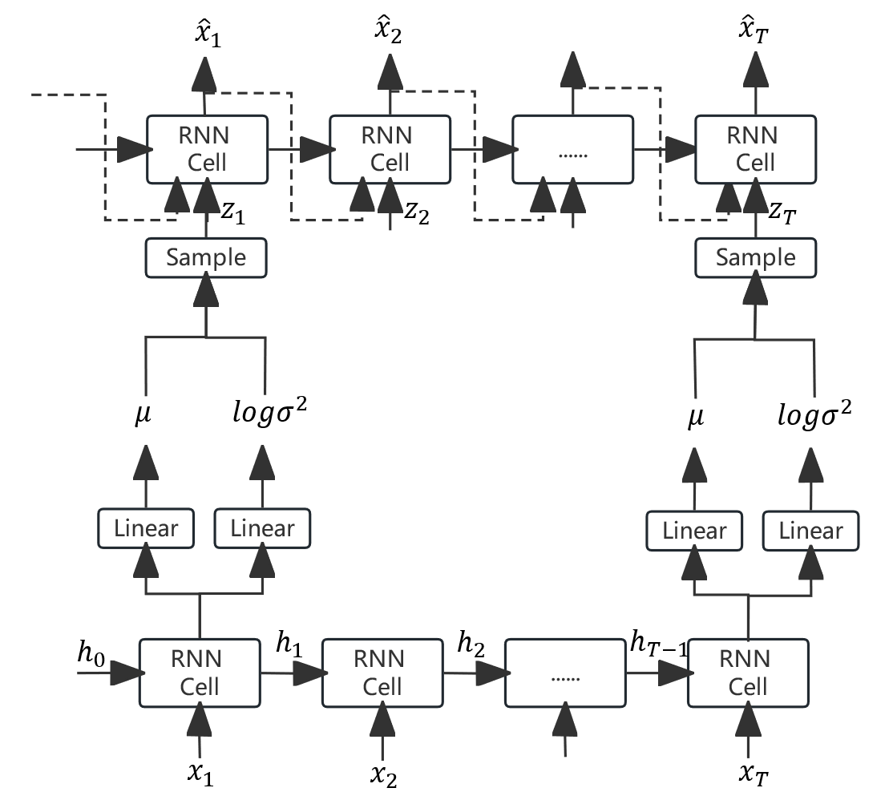

# STORN

This is an simple implement of STORN. It applies VAE into temporal data rather than image data.

### The difference with VRAE

The latent variable $z$ of VRAE has no temporal dependencies but the latent variable $z$ of STORN is a sequence $z_1, z_2,...,z_T$ .

The neural network structure of STORN is below:

### References

+ Bayer J, Osendorfer C. Learning stochastic recurrent networks[J]. arXiv preprint arXiv:1411.7610, 2014.

  [[1411.7610\] Learning Stochastic Recurrent Networks (arxiv.org)](https://arxiv.org/abs/1411.7610)

### Code explanation

1. data folder
   + Two data sets : stock_data.csv and ennergy_data.csv
   + Same with TimeGAN
2. metrics folder
   + PCA and t-SNE analysis between Original data and Synthetic data
   + Discriminative and predictive scores
   + Same with TimeGAN
3. data_loading.py
   + Transform raw time-series data to preprocessed time-series data
   + Same with TimeGAN
4. STORN.py
   + STORN model code : A combination of RNN/GRU network and VAE
   + Training process and training parameters code
5. main_STORN.py
   + Main code for importing data, training, generating data and visualizing
6. utils.py
   + Some utility functions for metrics
   + Same with TimeGAN
7. tutorial_STORN.ipynb
   + A .ipynb file of main code which has the same function with main_STORN.py

### How to start

Run tutorial_STORN.ipynb or main_STORN.py directly after  `pip install -r requirements.txt`

### Some possible reasons for bad results

+ The hyperparameter needs fine tuning.
+ **STORN model code maybe has some undetected mistakes.**
+ **It confused me a lot that the output data after sampling and generating is almost unchanged, which is shown in tutorial_STORN.ipynb**
