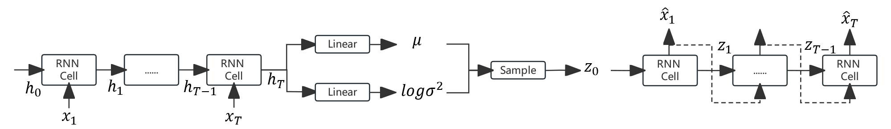

# VRAE

This is an simple implement of VRAE. It applies VAE into temporal data rather than image data.

### References

+ Fabius O, Van Amersfoort J R. Variational recurrent auto-encoders[J]. arXiv preprint arXiv:1412.6581, 2014.

  [[1412.6581\] Variational Recurrent Auto-Encoders (arxiv.org)](https://arxiv.org/abs/1412.6581)

+ Bowman S R, Vilnis L, Vinyals O, et al. Generating sentences from a continuous space[J]. arXiv preprint arXiv:1511.06349, 2015.

  [[1511.06349\] Generating Sentences from a Continuous Space (arxiv.org)](https://arxiv.org/abs/1511.06349)

### Code explanation

1. data folder
   + Two data sets : stock_data.csv and ennergy_data.csv
   + Same with TimeGAN
2. metrics folder
   + PCA and t-SNE analysis between Original data and Synthetic data
   + Discriminative and predictive scores
   + Same with TimeGAN
3. data_loading.py
   + Transform raw time-series data to preprocessed time-series data
   + Same with TimeGAN
4. VRAE.py
   + VRAE model code : A combination of RNN/GRU network and VAE
   + Training process and training parameters code
5. main_VRAE.py
   + Main code for importing data, training, generating data and visualizing
6. utils.py
   + Some utility functions for metrics
   + Same with TimeGAN
7. tutorial_VRAE.ipynb
   + A .ipynb file of main code which has the same function with main_VRAE.py

### How to start

Run tutorial_VRAE.ipynb or main_VRAE.py directly after  `pip install -r requirements.txt`

### Some possible reasons for bad results

+ The hyperparameter needs fine tuning.

+ The latent variable $z$ (or $h$ in code) is not a sequence but a simple multi-dimensional vector.

  The neural network structure of VRAE is below:

  

  

